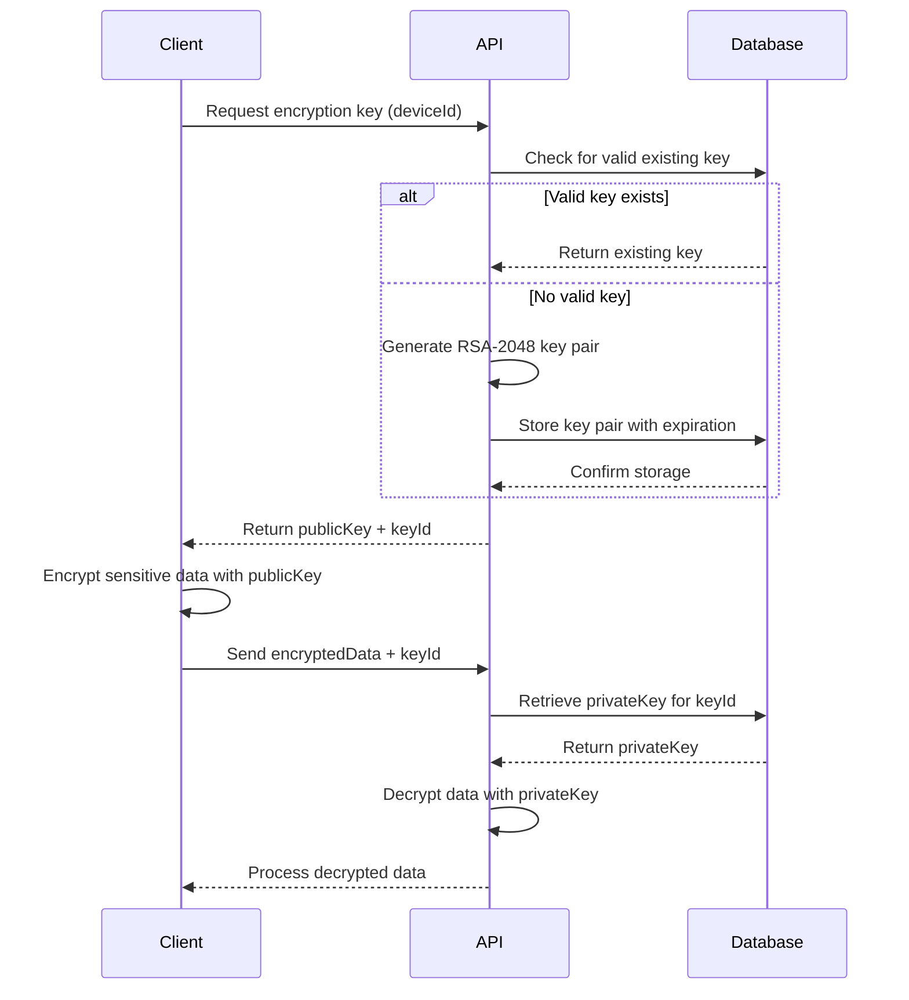

## Overview

The Key Management Service uses asymmetric RSA encryption to protect sensitive data. Each client device receives a unique RSA key pair consisting of a public key for encryption and a private key for decryption.

<Note>
  The service uses **RSA-2048** encryption with **PKCS1_OAEP_PADDING** for optimal security and compatibility.
</Note>

## RSA Key Pair Generation

### Technical Specifications

Keys are generated using Node.js's native `crypto` module with the following configuration:

```typescript
const { publicKey, privateKey } = await generateKeyPairAsync('rsa', {
  modulusLength: 2048,
  publicKeyEncoding: {
    type: 'spki',
    format: 'pem',
  },
  privateKeyEncoding: {
    type: 'pkcs8',
    format: 'pem',
  },
});
```

<Info>
  Reference: crypto.ts:19-29
</Info>

### Key Generation Parameters

| Parameter | Value | Description |
|-----------|-------|-------------|
| **Algorithm** | RSA | Asymmetric encryption algorithm |
| **Modulus Length** | 2048 bits | Key size providing strong security |
| **Public Key Type** | SPKI | Subject Public Key Info format |
| **Private Key Type** | PKCS8 | Private Key Information Syntax Standard |
| **Format** | PEM | Privacy-Enhanced Mail encoding |

## Public and Private Key Usage

### Public Key (Client-Side)

The public key is distributed to client applications and used to **encrypt** sensitive data before transmission:

```typescript
export function encryptData(data: string, publicKey: string): string {
  const buffer = Buffer.from(data, 'utf-8');
  const encrypted = crypto.publicEncrypt(
    {
      key: publicKey,
      padding: crypto.constants.RSA_PKCS1_OAEP_PADDING,
    },
    buffer,
  );
  
  return encrypted.toString('base64');
}
```

<Info>
  Reference: crypto.ts:44-59
</Info>

**Key Features:**
- Encrypted data is returned as a base64-encoded string
- Uses PKCS1_OAEP_PADDING for enhanced security
- Public keys can be safely shared with clients
- Each encryption produces different ciphertext (non-deterministic)

### Private Key (Server-Side Only)

The private key remains **secure on the server** and is used to **decrypt** data encrypted with the corresponding public key:

```typescript
export function decryptData(encryptedData: string, privateKey: string): string {
  const buffer = Buffer.from(encryptedData, 'base64');
  const decrypted = crypto.privateDecrypt(
    {
      key: privateKey,
      padding: crypto.constants.RSA_PKCS1_OAEP_PADDING,
    },
    buffer,
  );
  
  return decrypted.toString('utf-8');
}
```

<Info>
  Reference: crypto.ts:68-83
</Info>

<Warning>
  Private keys are **never exposed** to client applications. They are stored securely in the database and only accessed server-side for decryption operations.
</Warning>

## Key Storage and Management

### Database Schema

Each encryption key is stored with comprehensive metadata:

```typescript
await prismaService.clientEncryptionKey.create({
  data: {
    id: keyId,                    // Unique identifier
    deviceId,                     // Associated device
    appVersion,                   // Client app version
    publicKey,                    // PEM-encoded public key
    privateKey,                   // PEM-encoded private key (encrypted at rest)
    expiresAt: expirationDate,    // Automatic expiration
    createdAt: new Date(),
  },
});
```

<Info>
  Reference: encryption.service.ts:68-78
</Info>

### Key Identification

Each key pair receives a unique identifier combining timestamp and randomness:

```typescript
const keyId = `key_${Date.now()}_${crypto.randomBytes(12).toString('hex')}`;
```

This ensures:
- Globally unique identifiers
- Chronological ordering
- Cryptographic randomness to prevent prediction

## Key Lifecycle

<Accordion title="1. Key Generation">
  When a client requests an encryption key, the service:
  
  1. Checks for existing valid keys for the device
  2. If a valid key exists, returns it (avoiding unnecessary generation)
  3. Otherwise, generates a new RSA-2048 key pair
  4. Stores both keys in the database with expiration date
  5. Returns the public key and keyId to the client
  
  Reference: encryption.service.ts:34-86
</Accordion>

<Accordion title="2. Key Usage">
  During the key's lifetime:
  
  - **Client**: Uses public key to encrypt sensitive data (passcodes, PINs, etc.)
  - **Server**: Uses private key to decrypt received data
  - **Validation**: Each decryption checks if the key has expired
  - **Monitoring**: All operations are logged for security auditing
</Accordion>

<Accordion title="3. Key Expiration">
  Keys automatically expire after a configured period (default: 30 days):
  
  ```typescript
  const expirationDate = new Date();
  expirationDate.setDate(
    expirationDate.getDate() + this.keyRotationIntervalDays
  );
  ```
  
  Expired keys are rejected during decryption operations.
  
  Reference: encryption.service.ts:63-66
</Accordion>

<Accordion title="4. Key Deprecation">
  Expired or problematic keys are marked as deprecated:
  
  - Prevents use in new operations
  - Retained for a grace period (default: 90 days)
  - Eventually deleted from the database
  
  Reference: key-rotation.tasks.ts:28-70
</Accordion>

## Encryption Workflow



## Security Considerations

<Warning>
  **Private Key Security**: Private keys are stored in the database and must be protected with:
  - Database-level encryption at rest
  - Restricted access controls
  - Secure network connections (TLS)
  - Regular security audits
</Warning>

### Best Practices

1. **Never expose private keys**: Private keys should never be transmitted to clients or logged
2. **Validate key expiration**: Always check if a key has expired before use
3. **Use key rotation**: Regular rotation limits the impact of potential key compromise
4. **Monitor key usage**: Track encryption/decryption operations for anomalies
5. **Limit data size**: Enforce maximum encrypted data size to prevent resource exhaustion

## Related Topics

<CardGroup cols={2}>
  <Card title="Key Rotation" icon="rotate" href="/concepts/key-rotation">
    Learn about automated key rotation and lifecycle management
  </Card>
  <Card title="Security Measures" icon="shield" href="/concepts/security">
    Explore security features including rate limiting and validation
  </Card>
</CardGroup>