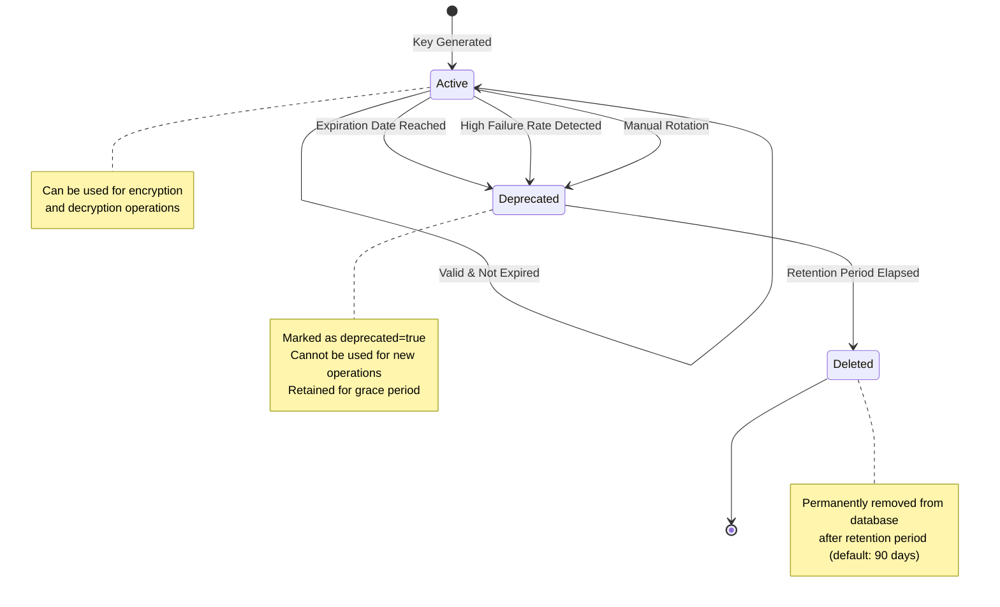

## Overview

Key rotation is a critical security practice that limits the lifetime of encryption keys. The Key Management Service implements **automated key rotation** to ensure that compromised keys have minimal impact and that encryption remains secure over time.

<Info>
  By default, encryption keys expire after **30 days** and are retained for **90 days** after expiration before permanent deletion.
</Info>

## Why Key Rotation Matters

Regular key rotation provides several security benefits:

- **Limits exposure window**: If a key is compromised, only data encrypted during that key's lifetime is at risk
- **Reduces crypto-analytic attacks**: Limiting the amount of data encrypted with a single key makes cryptanalysis harder
- **Enables compliance**: Many security standards require regular key rotation
- **Detects compromise**: Forced rotation can reveal if attackers are using stolen keys
- **Supports forward secrecy**: Old encrypted data cannot be decrypted even if current keys are compromised

## Expiration Policies

### Configurable Rotation Period

The service uses environment-based configuration for rotation intervals:

```typescript
this.keyRotationIntervalDays = this.configService.get(
  'ENCRYPTION_KEY_ROTATION_DAYS',
  30,  // Default: 30 days
);
```

<Info>
  Reference: encryption.service.ts:24-27
</Info>

### Key Expiration Calculation

When a new key is generated, its expiration date is automatically calculated:

```typescript
const expirationDate = new Date();
expirationDate.setDate(
  expirationDate.getDate() + this.keyRotationIntervalDays,
);

await this.prismaService.clientEncryptionKey.create({
  data: {
    id: keyId,
    deviceId,
    publicKey,
    privateKey,
    expiresAt: expirationDate,  // Automatic expiration
    createdAt: new Date(),
  },
});
```

<Info>
  Reference: encryption.service.ts:63-78
</Info>

## Automated Rotation Task

### Daily Rotation Schedule

The service runs an automated task every day at midnight to manage key lifecycle:

```typescript
@Cron(CronExpression.EVERY_DAY_AT_MIDNIGHT)
async handleKeyRotation() {
  this.logger.log('Running scheduled key rotation task');
  
  // 1. Mark expired keys as deprecated
  // 2. Delete old deprecated keys
  // 3. Identify and deprecate problematic keys
}
```

<Info>
  Reference: key-rotation.tasks.ts:27-29
</Info>

### Rotation Task Operations

<Accordion title="Step 1: Mark Expired Keys as Deprecated">
  The task identifies all non-deprecated keys that have passed their expiration date:
  
  ```typescript
  const expirationDate = new Date();
  const deprecatedCount = await this.prismaService.clientEncryptionKey.updateMany({
    where: {
      deprecated: false,
      expiresAt: {
        lt: expirationDate,  // Less than current date
      },
    },
    data: {
      deprecated: true,
      updatedAt: new Date(),
    },
  });
  
  this.logger.log(
    `Marked ${deprecatedCount.count} keys as deprecated due to expiration`
  );
  ```
  
  Reference: key-rotation.tasks.ts:33-50
</Accordion>

<Accordion title="Step 2: Clean Up Old Deprecated Keys">
  Keys that have been deprecated for longer than the retention period are permanently deleted:
  
  ```typescript
  this.keyRetentionDays = this.configService.get(
    'ENCRYPTION_KEY_RETENTION_DAYS',
    90,  // Default: 90 days after deprecation
  );
  
  const deleteThreshold = new Date();
  deleteThreshold.setDate(
    deleteThreshold.getDate() - this.keyRetentionDays,
  );
  
  const deletedCount = await this.prismaService.clientEncryptionKey.deleteMany({
    where: {
      deprecated: true,
      expiresAt: {
        lt: deleteThreshold,
      },
    },
  });
  
  this.logger.log(
    `Deleted ${deletedCount.count} deprecated keys older than ${this.keyRetentionDays} days`
  );
  ```
  
  Reference: key-rotation.tasks.ts:52-70
</Accordion>

<Accordion title="Step 3: Identify Problematic Keys">
  The service monitors encryption operations and identifies keys with high failure rates:
  
  ```typescript
  const problematicKeys = await this.monitoringService.findProblematicKeys(
    15  // 15% failure threshold
  );
  
  if (problematicKeys.length > 0) {
    await this.prismaService.clientEncryptionKey.updateMany({
      where: {
        id: {
          in: problematicKeys,
        },
      },
      data: {
        deprecated: true,
        updatedAt: new Date(),
      },
    });
    
    this.logger.log(
      `Marked ${problematicKeys.length} problematic keys as deprecated`
    );
  }
  ```
  
  This proactive rotation helps maintain service reliability and security.
  
  Reference: key-rotation.tasks.ts:73-96
</Accordion>

## Manual Key Rotation

### Rotating Keys for a Specific Device

The service provides an API to manually rotate keys for a specific device:

```typescript
async rotateKeysForDevice(
  deviceId: string,
): Promise<{ publicKey: string; keyId: string }> {
  // Mark existing keys as deprecated
  await this.prismaService.clientEncryptionKey.updateMany({
    where: {
      deviceId,
      deprecated: false,
    },
    data: {
      deprecated: true,
      updatedAt: new Date(),
    },
  });
  
  // Generate new key
  return this.generateClientEncryptionKey(deviceId);
}
```

<Info>
  Reference: encryption.service.ts:185-210
</Info>

### GraphQL Mutation

Clients can trigger manual rotation through the GraphQL API:

```graphql
mutation RotateKey {
  rotateClientEncryptionKey(input: {
    deviceId: "device-123"
    appVersion: "1.0.0"
  }) {
    publicKey
    keyId
  }
}
```

<Info>
  Reference: encryption.resolver.ts:66-93
</Info>

## Key Lifecycle States



## Key Reuse Strategy

### Avoiding Unnecessary Key Generation

When a client requests an encryption key, the service first checks for existing valid keys:

```typescript
// Check for existing valid keys first
const existingKey = await this.getValidKeyForDevice(deviceId);
if (existingKey) {
  this.logger.log(
    `Using existing valid key for device: ${deviceId}, keyId: ${existingKey.id}`
  );
  return {
    publicKey: existingKey.publicKey,
    keyId: existingKey.id,
  };
}

// Only generate new key if no valid key exists
const { publicKey, privateKey } = await generateKeyPair();
```

<Info>
  Reference: encryption.service.ts:44-57
</Info>

### Valid Key Query

The service queries for non-deprecated, non-expired keys:

```typescript
private async getValidKeyForDevice(
  deviceId: string,
): Promise<{ id: string; publicKey: string } | null> {
  const validKey = await this.prismaService.clientEncryptionKey.findFirst({
    where: {
      deviceId,
      deprecated: false,
      expiresAt: {
        gt: new Date(),  // Greater than current date
      },
    },
    orderBy: {
      createdAt: 'desc',  // Most recent first
    },
  });
  
  return validKey ? { id: validKey.id, publicKey: validKey.publicKey } : null;
}
```

<Info>
  Reference: encryption.service.ts:259-276
</Info>

## Monitoring Key Rotation

### Failure Rate Analysis

The monitoring service analyzes decryption failures to identify problematic keys:

```typescript
async findProblematicKeys(
  failureThresholdPercent: number = 10,
): Promise<string[]> {
  const problematicKeys: any = await this.prismaService.$queryRaw`
    WITH key_stats AS (
      SELECT 
        key_id,
        SUM(CASE WHEN status = 'failure' THEN 1 ELSE 0 END) * 100.0 / COUNT(*) as failure_rate,
        COUNT(*) as total_operations
      FROM "EncryptionMetric"
      WHERE key_id IS NOT NULL AND operation = 'decrypt'
      GROUP BY key_id
      HAVING COUNT(*) >= 5  -- Minimum operations threshold
    )
    SELECT key_id
    FROM key_stats
    WHERE failure_rate >= ${failureThresholdPercent}
    ORDER BY failure_rate DESC, total_operations DESC
  `;
  
  return problematicKeys.map((k) => k.key_id);
}
```

<Info>
  Reference: encryption-monitoring.service.ts:112-141
</Info>

<Warning>
  Keys with a failure rate of **15% or higher** are automatically deprecated during the daily rotation task.
</Warning>

## Configuration Options

| Environment Variable | Default | Description |
|---------------------|---------|-------------|
| `ENCRYPTION_KEY_ROTATION_DAYS` | 30 | Days until a key expires |
| `ENCRYPTION_KEY_RETENTION_DAYS` | 90 | Days to retain deprecated keys before deletion |

### Example Configuration

```bash
# .env file
ENCRYPTION_KEY_ROTATION_DAYS=30
ENCRYPTION_KEY_RETENTION_DAYS=90
```

## Best Practices

<CardGroup cols={2}>
  <Card title="Regular Rotation" icon="clock">
    Use the default 30-day rotation period unless compliance requires a different interval
  </Card>
  <Card title="Grace Period" icon="hourglass">
    Maintain a retention period to handle delayed requests with expired keys
  </Card>
  <Card title="Monitor Failures" icon="chart-line">
    Track key failure rates to identify potential security issues early
  </Card>
  <Card title="Document Rotation" icon="file-lines">
    Keep audit logs of all rotation events for compliance and troubleshooting
  </Card>
</CardGroup>

## Related Topics

<CardGroup cols={2}>
  <Card title="Encryption Keys" icon="key" href="/concepts/encryption-keys">
    Learn about RSA key generation and usage
  </Card>
  <Card title="Security Measures" icon="shield" href="/concepts/security">
    Explore rate limiting and validation features
  </Card>
</CardGroup>